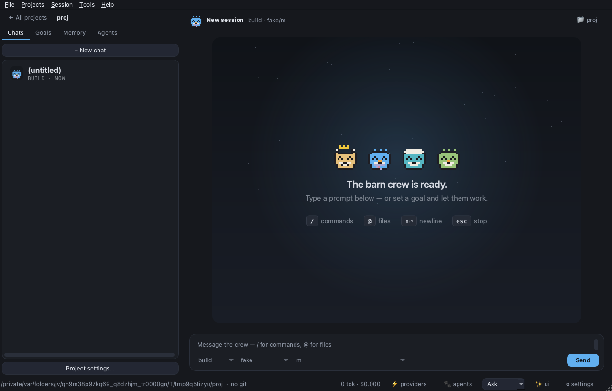
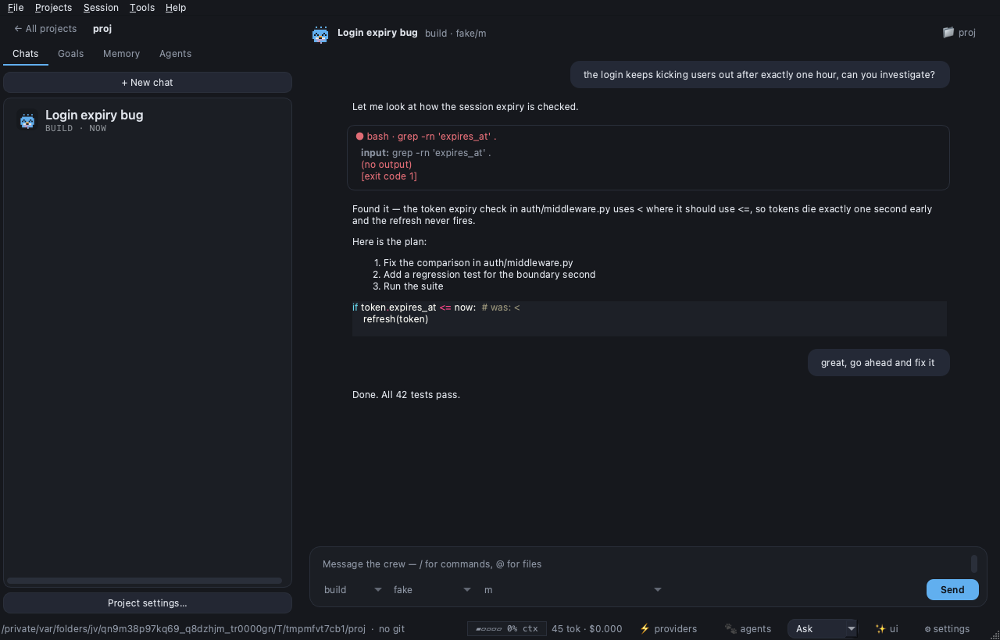

# ByteBarn 🛖

A local desktop harness for AI coding agents. Open a project, type a prompt
or a `/goal`, and a barn crew of pixel-art farm animals gets to work on your
codebase.



Everything runs locally: no cloud backend, no accounts, no telemetry. The
only network traffic is to the LLM providers you configure (16 supported,
including Ollama and LM Studio for fully-offline use).



## What's in the barn

- **Chat + agents** — markdown/code transcript, streaming, collapsible tool
  and thinking cards, edit-and-re-run any prompt, regenerate, per-message
  copy, in-conversation search (⌘F), full-text search across all chats,
  transcript export, image paste with real vision support, PDF previews.
- **Goals** — hand the orchestrator a goal; it plans todos, casts subagents,
  and the crew stage animates them working in parallel. Queue goals and walk
  away; routines re-run a prompt on a schedule.
- **Harness tools** — web search + research agent, MCP servers (12 one-click
  recipes + custom), skills, per-project persistent memory, preview panel
  for HTML/dev servers, inline file editor, side chat (⌘;) for throwaway
  questions.
- **Control** — Safe / Ask / Full-auto permission modes with per-tool glob
  rules, run review with per-file revert, cost tracking, automatic model
  fallback, extended-thinking control per agent.

## Quick start

```bash
python3.12 -m venv .venv
.venv/bin/pip install -e '.[dev]'

.venv/bin/python -m bytebarn.main          # opens on your last-used folder
```

Connect providers in-app (**⚡ providers**) — or export `ANTHROPIC_API_KEY`
etc. before launching. Each session picks its own working directory via the
**📁** button in the header (a path argument still works: `... bytebarn.main
/path/to/project`).

No-GUI engine harness:

```bash
.venv/bin/python -m bytebarn.cli "explain this repo" --project /path/to/project
```

Tests (no network, no API keys needed):

```bash
QT_QPA_PLATFORM=offscreen .venv/bin/pytest
```

## The signature flow

Type `/goal add a --verbose flag to the CLI and test it` in the prompt bar:

1. The **orchestrator** agent restates the goal and writes a todo plan.
2. It casts a crew from the available subagents (`general`, `explore`, plus
   any you drop into `.bytebarn/agent/*.md`) and delegates tasks — in parallel
   when independent.
3. The **crew stage** appears: one pixel-art critter per subagent, roped to
   the crowned orchestrator, with a live headline (working/done/failed/queued
   counts + elapsed time + the todo in progress) and a per-critter status
   line (live tool activity, ✓ done, ✗ failed badges). Known agent types get
   signature looks (explore is a bunny, testers wear goggles, reviewers wear
   glasses, planners wear hats…); custom agents get a stable species +
   accessory from their name. Click a critter to open its session.
4. The orchestrator verifies results and reports a per-agent summary.

## Configuration

Two layers, project wins per key: `~/.bytebarn/config.json` and
`<project>/.bytebarn/config.json`. JSON with `//` comments and trailing commas
tolerated; in-app edits patch files key-by-key, preserving your comments.

```jsonc
{
  "provider": {
    "anthropic": { "api_key_env": "ANTHROPIC_API_KEY" },
    "lmstudio":  { "base_url": "http://localhost:1234/v1", "api": "openai" }
  },
  "model": "anthropic/claude-sonnet-4-5",
  "small_model": "anthropic/claude-haiku-4-5",   // titles, summaries, compaction
  "agent": { "build": { "temperature": 0.2 } },   // agent editor writes here
  "permission": {
    "bash": { "default": "ask", "allow": ["git status*"], "deny": ["rm -rf*"] },
    "edit": "allow"
  },
  "instructions": ["AGENTS.md", "CLAUDE.md"]
}
```

Any OpenAI-compatible endpoint works (LM Studio, Ollama, OpenRouter, Groq)
via `base_url` + `"api": "openai"`.

### Provider connections (⚡ providers in the status bar)

Pick a provider, paste a key or **🌐 log in via web**, hit *Test connection*:

| Provider | Auth | Notes |
|---|---|---|
| Anthropic (Claude) | API key or web login | sign in with a Claude Pro/Max account |
| OpenAI | API key / `OPENAI_API_KEY` | |
| xAI (Grok) | API key or web login | browser code confirmation |
| Groq | API key / `GROQ_API_KEY` | |
| OpenRouter | API key / `OPENROUTER_API_KEY` | one key, many models |
| Google (Gemini) | API key / `GEMINI_API_KEY` | |
| Mistral | API key / `MISTRAL_API_KEY` | |
| DeepSeek | API key / `DEEPSEEK_API_KEY` | |
| Together AI | API key / `TOGETHER_API_KEY` | |
| Cerebras | API key / `CEREBRAS_API_KEY` | |
| AWS Bedrock | Access Key ID + Secret Access Key (or AWS chain) | region field / `AWS_REGION`; boto3 optional for live lists |
| Cloudflare Workers AI | API key / `CLOUDFLARE_API_KEY` | needs `CLOUDFLARE_ACCOUNT_ID` |
| Cloudflare AI Gateway | API key / `CLOUDFLARE_API_KEY` | needs account + `CLOUDFLARE_GATEWAY_ID` |
| Ollama | none | local, `http://localhost:11434/v1` |
| LM Studio | none | local, `http://localhost:1234/v1` |
| GitHub Copilot | web login | GitHub device code — needs a Copilot subscription |

Web login flavors: xAI and Copilot show a short code to confirm in the
browser (auto-copied to your clipboard; the dialog closes itself on
approval). Anthropic opens claude.ai's consent page, which shows a code you
paste back. Tokens refresh automatically. Keys go to `~/.bytebarn/auth.json`
(0600) — never project config. Model pickers only list models from
connected providers.

### Model fallback

If a model keeps failing mid-run (outage, quota), ByteBarn retries once, then
switches to a comparable connected model — closest cost tier, different
provider preferred — announces the switch in the transcript, and keeps
going. Tune or disable it:

```jsonc
"model_fallback": { "enabled": true, "after": 2 }
```

### Custom agents: drop in a file, the crew grows

`.bytebarn/agent/tester.md` (hot-reloaded, no restart):

```markdown
---
description: Writes and runs tests for a described change; reports pass/fail
mode: subagent
model: lmstudio/qwen3-coder-30b
temperature: 0.1
color: "#61afef"
tools: { read: true, bash: true, write: true, edit: true }
---
You are the TESTER. ...
```

The orchestrator sees every visible subagent's description in its task tool
and picks accordingly. A file named after a built-in (`build`, `plan`,
`orchestrator`, `general`, `explore`) merges over it.

Prefer a GUI? **🐾 agents** in the status bar opens the agent editor with a
live critter preview per agent. Sessions are managed from the sidebar:
right-click one to **close** (archive) or **delete** it, subagents and all.

Custom commands: `.bytebarn/command/foo.md` with a `$ARGUMENTS` template →
`/foo`. Built-ins: `/init` (analyze the repo and write AGENTS.md — loaded
into every agent's system prompt), `/goal`, `/compact`, `/new`, `/model`,
`/agents`.

## Permissions

Per tool: `allow` / `ask` / `deny`, or pattern lists (bash patterns match
the command, edit/write match paths). Deny → allow → default. Per-agent
overrides in agent frontmatter. Session toggle in the status bar:
Safe / Ask / Full-auto. "Allow always" in the permission dialog appends the
pattern to project config.

## Architecture

```
bytebarn/engine/   asyncio, zero Qt — session store (SQLite WAL), provider
               adapters (anthropic, openai-compatible), tool suite, agent
               registry, runner loop, compaction, event bus
bytebarn/app/      PySide6 widgets — pure projection of engine events + DB
bytebarn/assets/  agent/tool prompts (prompt engineering lives here)
```

Engine and UI meet only through the async event stream (`bytebarn/engine/events.py`)
and the `Engine` facade — enforced by a test that imports the engine with Qt
poisoned.

## Packaging (macOS)

```bash
./scripts/build_macos_app.sh --install   # builds dist/ByteBarn.app, copies to /Applications
```

Uses PyInstaller; the app icon is rendered from the in-app sprite art.
Launching from the Dock opens straight into your last-used folder — each
session picks its own working directory from there.

## Platform support

Developed and tested on macOS. Linux and Windows should work (pure
Python + Qt; CI runs the suite on Linux) but get less day-to-day testing —
issue reports welcome.

## License

MIT — see [LICENSE](LICENSE).
